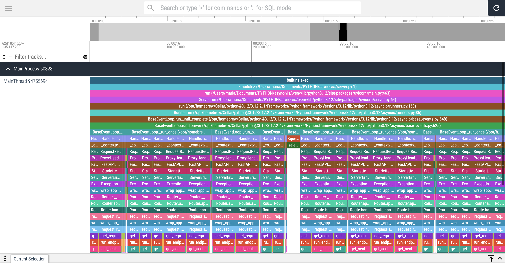

# async-viz

A toy project to visualize FastAPI asyncio execution using viztracer
python lib (https://github.com/gaogaotiantian/viztracer)

Viztracer allows to visualize FastAPI server function execution chart
to illustrate how async stuff works.

This repo consists of:

- FastAPI server with 3 toy endpoints
- Module for sending requests to the server
- Script which launches FastAPI server (optionally under viztracer) 
and sends the specified number of requests

## Prerequisites

- initialize `venv`
- install requirements from `requirements.txt`
- go NUTS!!!

## Usage

Run the main script:

```
usage: main.py [-h] --tasks TASKS --requests REQUESTS [--trace] [--suppress-output] [--pre-sleep-ms PRE_SLEEP_MS]

options:
  -h, --help            show this help message and exit
  --tasks TASKS         How many coroutines to run for sending request
  --requests REQUESTS   How many request to send per coroutine
  --trace               If true trace execution with viztracer
  --suppress-output     If true FastAPI logs will not be printed
  --pre-sleep-ms PRE_SLEEP_MS
                        How much time to wait (in ms) for FastAPI server to startup
```

This will spin up FastAPI server, wait for some time until it starts
and then spin up the specified number of coroutines (`asyncio.task`)
each of them sending the specified number of requests to this server
and shut down the server after all is done.

If `--trace` is specified, this script produces `result.json` file
in the current folder.

You can run `vizviewer result.json` to visually inspect the execution
chart:



## ToDo

- [ ] Add server option to control how much time it sleeps 
synchronously
- [ ] Log how fast the requests were processed
- [ ] Inspect how slower is the server with different logging 
configurations
